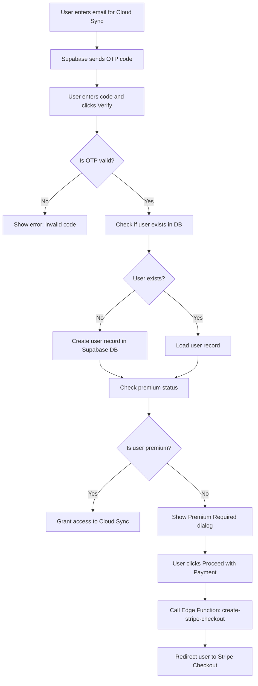
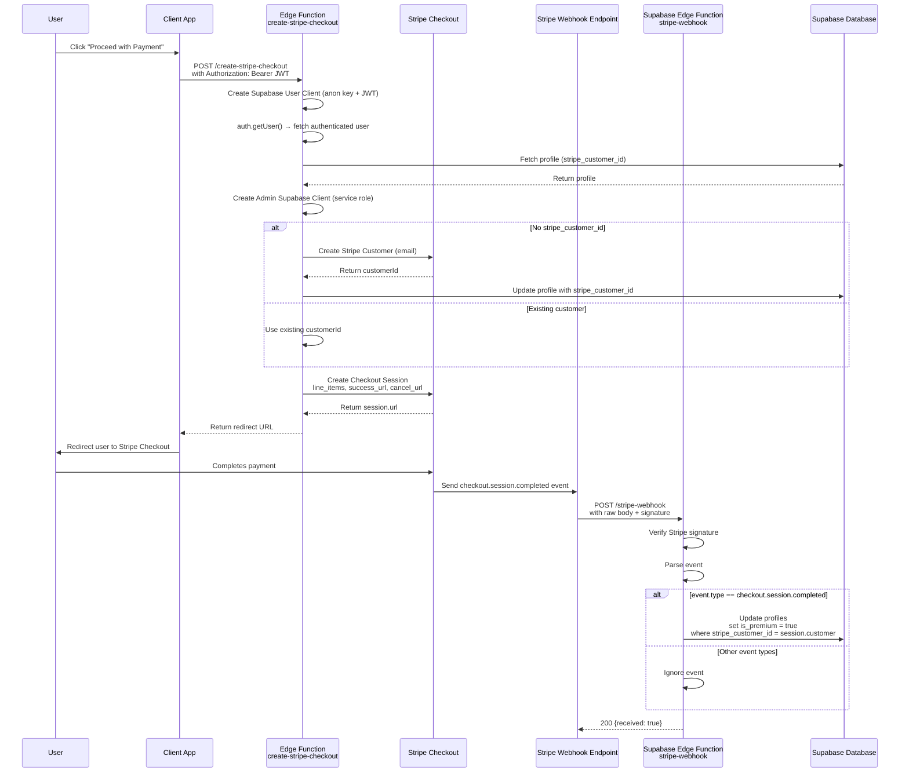
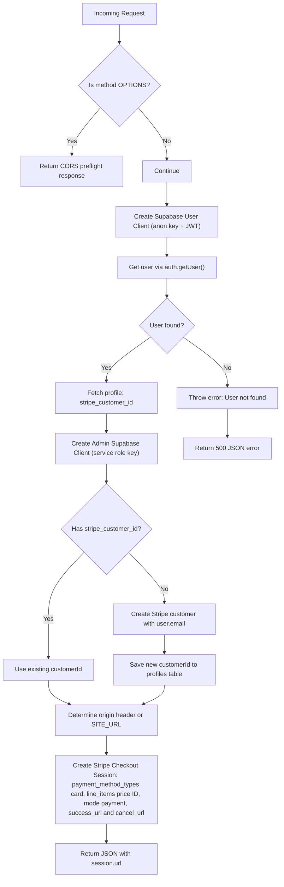
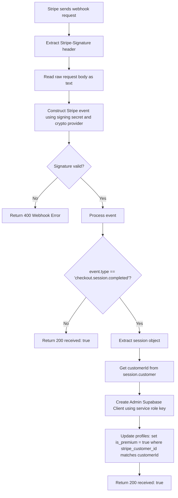
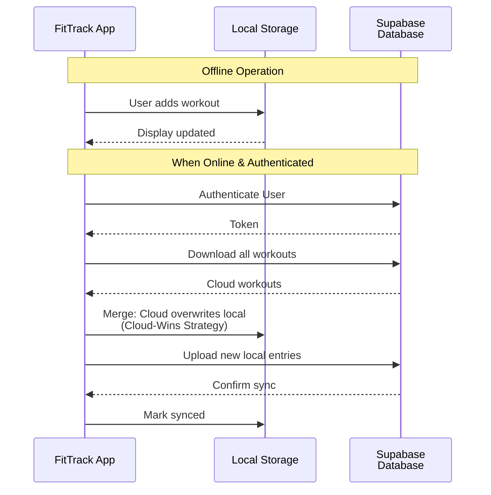
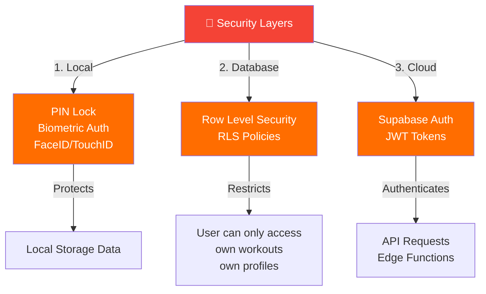
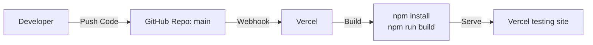
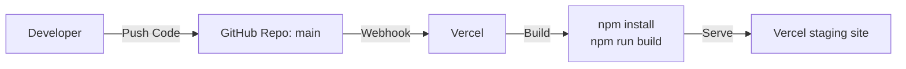
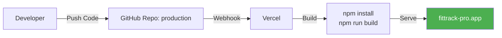

# FitTrack Pro - System Architecture Diagram

## User sign up and premium check flow
[Mermaid Live Editor](https://mermaid.live/edit)

## Stripe Checkout + Webhook Confirmation
[Mermaid Live Editor](https://mermaid.live/edit)

## Edge Function: create-stripe-checkout
[Mermaid Live Editor](https://mermaid.live/edit)

## Edge Function: stripe-webhook
[Mermaid Live Editor](https://mermaid.live/edit)

## Data Flow: Sync Strategy (Premium)
[Mermaid Live Editor](https://mermaid.live/edit)

## Security & Authentication
[Mermaid Live Editor](https://mermaid.live/edit)

## Deployment Pipeline

### Test
- via the `main` git branch

[Mermaid Live Editor](https://mermaid.live/edit)

### Staging
- via the `staging` git branch
- this gives you the chance to ensure your application is correctly configured for production by updating the following variables in the client-side `App.tsx` file. These values must point to your production Supabase project so payments and authentication are handled by the correct instance:
  - `SUPABASE_URL`
  - `SUPABASE_ANON_KEY`

[Mermaid Live Editor](https://mermaid.live/edit)

### Production
[Mermaid Live Editor](https://mermaid.live/edit)

- via the `production` git branch

---

## Technologies & Services Summary

| Component | Technology | Purpose |
|-----------|-----------|---------|
| **Frontend** | React + Vite + Tailwind CSS | PWA interface |
| **Local Storage** | IndexedDB / LocalStorage | Offline-first data |
| **Hosting** | Vercel | Global CDN deployment |
| **Backend** | Supabase (PostgreSQL) | User data & sync |
| **Authentication** | Supabase Auth | User accounts & JWT |
| **Payments** | Stripe + Edge Functions | Premium subscriptions |
| **Testing** | Checkly | Cloud-based monitoring |
| **Version Control** | GitHub | Source code management |
| **Security** | RLS, PIN, Biometric | Data protection |
