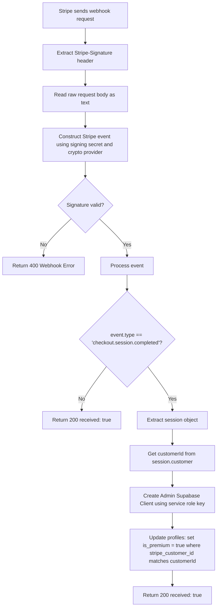

# FitTrack Pro - System Architecture Diagram

## User sign up and premium check flow


## Stripe Checkout + Webhook Confirmation

```mermaid
sequenceDiagram
    participant U as User
    participant C as Client App
    participant EF as Edge Function<br/>create-stripe-checkout
    participant ST as Stripe Checkout
    participant WH as Stripe Webhook Endpoint
    participant SW as Supabase Edge Function<br/>stripe-webhook
    participant DB as Supabase Database

    %% --- Checkout Session Creation ---
    U->>C: Click "Proceed with Payment"
    C->>EF: POST /create-stripe-checkout<br/>with Authorization: Bearer JWT

    EF->>EF: Create Supabase User Client (anon key + JWT)
    EF->>EF: auth.getUser() → fetch authenticated user
    EF->>DB: Fetch profile (stripe_customer_id)
    DB-->>EF: Return profile

    EF->>EF: Create Admin Supabase Client (service role)

    alt No stripe_customer_id
        EF->>ST: Create Stripe Customer (email)
        ST-->>EF: Return customerId
        EF->>DB: Update profile with stripe_customer_id
    else Existing customer
        EF->>EF: Use existing customerId
    end

    EF->>ST: Create Checkout Session<br/>line_items, success_url, cancel_url
    ST-->>EF: Return session.url

    EF-->>C: Return redirect URL
    C->>U: Redirect user to Stripe Checkout

    %% --- Payment + Webhook ---
    U->>ST: Completes payment

    ST->>WH: Send checkout.session.completed event

    WH->>SW: POST /stripe-webhook<br/>with raw body + signature

    SW->>SW: Verify Stripe signature
    SW->>SW: Parse event

    alt event.type == checkout.session.completed
        SW->>DB: Update profiles<br/>set is_premium = true<br/>where stripe_customer_id = session.customer
    else Other event types
        SW->>SW: Ignore event
    end

    SW-->>WH: 200 {received: true}

```



## Edge Function: create-stripe-checkout

```mermaid
flowchart TD

%% --- Request + CORS ---
A(Incoming Request) --> B{Is method OPTIONS?}
B -->|Yes| C(Return CORS preflight response)
B -->|No| D(Continue)

%% --- User Client Setup ---
D --> E(Create Supabase User Client (anon key + JWT))
E --> F(Get user via auth.getUser())
F --> G{User found?}
G -->|No| H(Throw error: User not found)
G -->|Yes| I(Fetch profile: stripe_customer_id)

%% --- Admin Client Setup ---
I --> J(Create Admin Supabase Client (service role key))

%% --- Stripe Customer Handling ---
J --> K{Has stripe_customer_id?}
K -->|Yes| L(Use existing customerId)
K -->|No| M(Create Stripe customer with user.email)
M --> N(Save new customerId to profiles table)

%% --- Determine Origin ---
L --> O(Determine origin header or SITE_URL)
N --> O

%% --- Create Checkout Session ---
O --> P(Create Stripe Checkout Session: payment_method_types card, line_items price ID, mode payment, success_url and cancel_url)

P --> Q(Return JSON with session.url)

%% --- Error Handling ---
H --> R(Return 500 JSON error)


```

## Edge Function: stripe-webhook




## Data Flow: Sync Strategy (Premium)


## Payment Flow


## Security & Authentication


## Deployment Pipeline


---

## Technologies & Services Summary

| Component | Technology | Purpose |
|-----------|-----------|---------|
| **Frontend** | React + Vite + Tailwind CSS | PWA interface |
| **Local Storage** | IndexedDB / LocalStorage | Offline-first data |
| **Hosting** | Vercel | Global CDN deployment |
| **Backend** | Supabase (PostgreSQL) | User data & sync |
| **Authentication** | Supabase Auth | User accounts & JWT |
| **Payments** | Stripe + Edge Functions | Premium subscriptions |
| **Testing** | Checkly | Cloud-based monitoring |
| **Version Control** | GitHub | Source code management |
| **Security** | RLS, PIN, Biometric | Data protection |
