# FitTrack Pro - System Architecture Diagram

## Setup & Infrastructure Overview

```mermaid
graph TD
    A["📱 FitTrack Pro App<br/>React + Vite + Tailwind CSS"] -->|Reads/Writes| B["💾 Local Storage<br/>Offline-First PWA"]
    
    A -->|When Online| C["☁️ Vercel<br/>Hosting & Deployment"]
    C -->|Serves| A
    
    D["🔐 GitHub<br/>Version Control"] -->|Push to| C
    D -->|Triggers| E["⚙️ Vercel Build<br/>npm run build → dist/"]
    E -->|Deploys| C
    
    A -->|Auth & Sync| F["🔑 Supabase<br/>Backend & Database"]
    F -->|Profiles Table| G["👤 User Profiles<br/>Premium Status<br/>Stripe Customer ID"]
    F -->|Workouts Table| H["🏋️ Workout Logs<br/>Cloud Storage"]
    
    H -->|Cloud-Wins<br/>Conflict Resolution| B
    B -->|Syncs with| H
    
    A -->|Payment Intent| I["💳 Stripe<br/>Premium Payments"]
    I -->|Updates| G
    
    F -->|Edge Functions| J["⚡ Supabase Edge Functions<br/>create-stripe-checkout<br/>stripe-webhook"]
    J -->|Communicates with| I
    
    A -->|Testing| K["🧪 Checkly<br/>Cloud Tests"]
    K -->|Monitors| C
    
    L["🌐 Domain<br/>.app"]
    L -->|Points to| C
    
    M["🔒 Security<br/>RLS Policies<br/>PIN Lock<br/>Biometric Auth"] -->|Protects| B
    M -->|Protects| F
    
    style A fill:#4CAF50,color:#fff
    style B fill:#2196F3,color:#fff
    style C fill:#FF6D00,color:#fff
    style F fill:#9C27B0,color:#fff
    style G fill:#9C27B0,color:#fff
    style H fill:#9C27B0,color:#fff
    style I fill:#FBC02D,color:#000
    style J fill:#9C27B0,color:#fff
    style K fill:#00BCD4,color:#fff
    style M fill:#F44336,color:#fff
```

## Data Flow: Sync Strategy (Premium)

## Payment Flow

## Security & Authentication

## Deployment Pipeline

---

## Technologies & Services Summary

| Component | Technology | Purpose |
|-----------|-----------|---------|
| **Frontend** | React + Vite + Tailwind CSS | PWA interface |
| **Local Storage** | IndexedDB / LocalStorage | Offline-first data |
| **Hosting** | Vercel | Global CDN deployment |
| **Backend** | Supabase (PostgreSQL) | User data & sync |
| **Authentication** | Supabase Auth | User accounts & JWT |
| **Payments** | Stripe + Edge Functions | Premium subscriptions |
| **Testing** | Checkly | Cloud-based monitoring |
| **Version Control** | GitHub | Source code management |
| **Security** | RLS, PIN, Biometric | Data protection |
